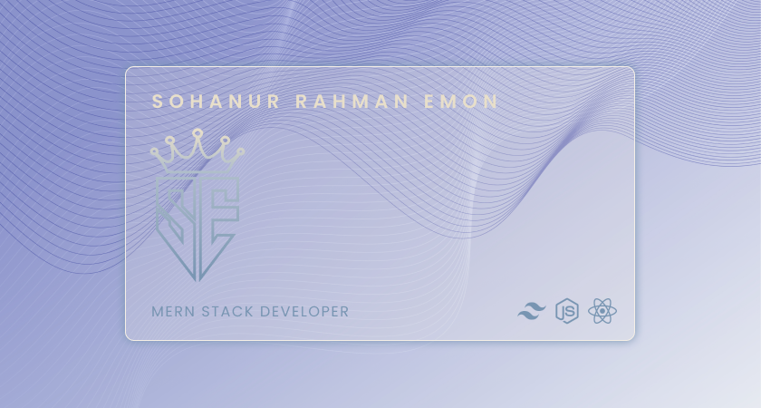

<link href="./styles/output.css" rel="stylesheet"></link>
<link href="./styles/mine.css" rel="stylesheet"></link>

<!-- connection section -->

<h1 class='text-4xl text-github'> 📨 Connect with me</h1>

<!-- overview section -->
 
<h1 align='center' class='text-4xl text-github'> 🪟 Current overview</h1>
 
<section id='overview'>
<article align='left' class='texts'>

 🔭 I’m looking - For an intern.

 🌱 I’m exploring - Three.js

 ⚡ My motivation - Act what you want to be.

</article>
<aside >

</aside>

</section>
