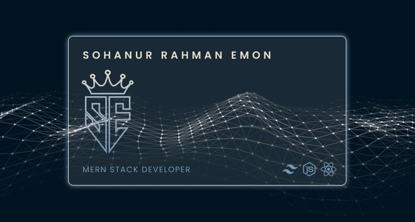

Hi This is Sohanur Rahman Emon
===========================================================================================================================================

## Junior Web Developer

- 🌍 Based in [Dhaka, Bangladesh](https://goo.gl/maps/huvdBTHzafPSi3NG9)
- 🖥️ See my portfolio at [SohanEmon](http://sohanemon.netlify.app)
- ✉️ Contact me at [m.sohanemon@gmail.com](mailto:m.sohanemon@gmail.com)

<!-- follower card -->
 

<!-- overview section -->
 
<h1 align='center' style='color: #7895B2'> 🪟 Current overview</h1>
 

### 🔎 I’m looking - For an intern.

### 🧠 I'm learning - GraphQL

### 🧑‍🤝‍🧑 I’m eager - To collaborating on   Interesting Projects

### ⚡ My motivation - Act what you want to be.

 

<!-- skills  -->
 

<h1 align='center'  style='color: #7895B2'> 💪 Skills</h1>

<!-- connection section -->

<h1  style='color: #7895B2'> 📨 Connect with me</h1>

 
 

 
  
 

 

 
 
  
 
 

 
  

