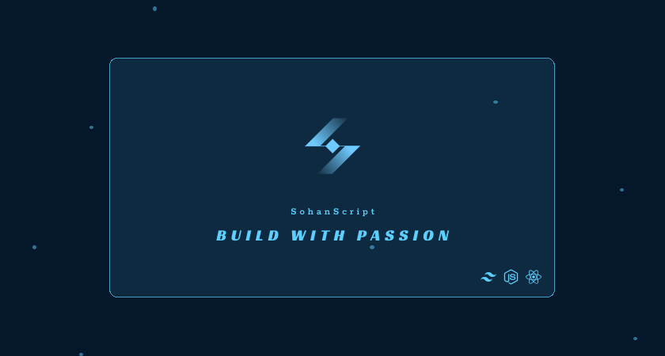

Hi This is 👇
 
===========================================================================================================================================

    

  <a href="https://goo.gl/maps/huvdBTHzafPSi3NG9">🌍 Based in Dhaka, Bangladesh</a> 
  <a href="http://sohanemon.vercel.app">🖥️ Portfolio</a> | 
  <a href="mailto:sohanemon@outlook.com">✉️ Contact</a> | 
  <a href="https://wa.me/8801626420807">📞 WhatsApp</a> 
  <a href="https://t.me/sohanemon">💬 Telegram</a> 
 

 
 <!---

  
  

 
  --->

<!-- overview section -->
 
<h1 align='center' style='color: #7895B2'> 🪟 Current overview</h1>
 

### 🔎 I’m looking - For job in a reputated company. [My resume](https://drive.google.com/file/d/1r6rwOaL5-T7eFr97vGJi6OYOWRvMybpv/view)

### 🧠 I'm learning - Three.js

### 🧑‍🤝‍🧑 I’m eager - To collaborating on Interesting Projects

### ⚡ My motivation - Act what you want to be.

 
 
<h1 align='center'  style='color: #7895B2'> 💪 Skills</h1>

 

<!-- My blogs section here -->
 
<h1  align='center'  style='color: #7895B2'> 📝 Recent Blogs</h1>
<ul style='display:flex; flex-wrap: wrap; justify-content: center; gap: 25px;'>
  <li><a href="https://sohanemon.vercel.app/article/grouping-variants-in-tailwind-css-made-easy">Grouping Variants in Tailwind CSS Made Easy</a></li>
  <li><a href="https://sohanemon.vercel.app/article/making-sticky-work-in-complex-layouts">Making "Sticky" Work in Complex Layouts</a></li>
  <li><a href="https://sohanemon.vercel.app/article/navigating-your-way-next-js-routing-cheat-sheet-app-dir">Navigating Your Way: Next.js Routing Cheat sheet (App-Dir)</a></li>

</ul>

<!-- My npm packages section here -->
 
<h1  align='center'  style='color: #7895B2'> 📦 NPM Packages</h1>
<ul style='display:flex; flex-wrap: wrap; justify-content: center; gap: 25px;'>
  <li><a href="https://www.npmjs.com/package/@sohanemon/next-image">@sohanemon/next-image</a></li>
  <li><a href="https://www.npmjs.com/package/@sohanemon/motion">@sohanemon/motion</a></li>
  <li><a href="https://www.npmjs.com/package/@sohanemon/utils">@sohanemon/utils</a></li>
</ul>

<!-- My VSCode extension section here -->
 
<h1  align='center'  style='color: #7895B2'> 🐝 VSCode Extensions</h1>
<ul style='display:flex; flex-wrap: wrap; justify-content: center; gap: 25px;'>
  <li><a href="https://marketplace.visualstudio.com/items?itemName=SohanEmon.react-next-js-code-snippets">React Next JS Code Snippets</a></li>
    <li><a href="https://marketplace.visualstudio.com/items?itemName=SohanEmon.firebase-wizard">Firebase Wizard</a></li>
  <li><a href="https://marketplace.visualstudio.com/items?itemName=SohanEmon.auto-commit-gpt">Auto Commit with GPT
</a></li>
  <li><a href="https://marketplace.visualstudio.com/items?itemName=SohanEmon.oneman-web-extensions">OneMan Web Extensions</a></li>
      <li><a href="https://marketplace.visualstudio.com/items?itemName=SohanEmon.shadcn-wizard">Shadcn Wizard</a></li>
</ul>

<!-- github stats -->
 
 

 

 
 

    

<!---

-->

<!-- connection section -->

<h1  style='color: #7895B2'> 📬 Socials</h1>

           

 

